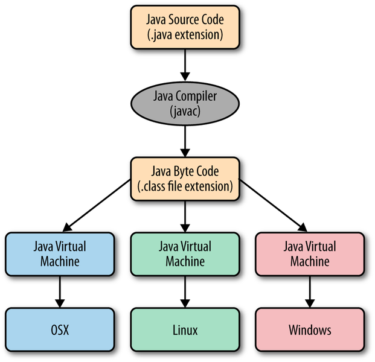
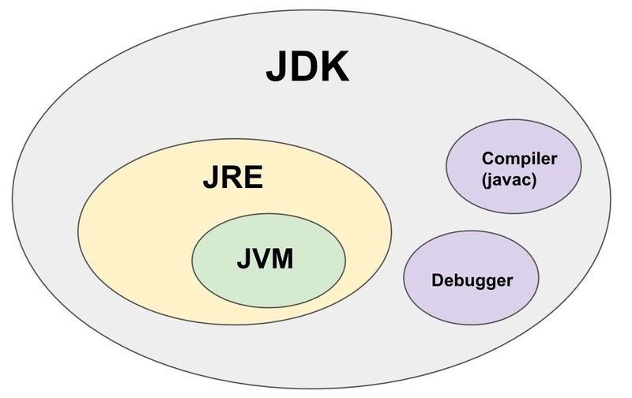
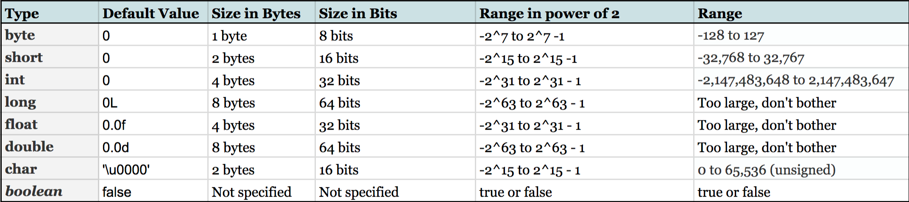

# How does Java work? 

### Java 의 플랫폼 독립성
- Java 의 가장 큰 장점으로 꼽히는 것은 바로 언어의 플랫폼 독립성 (Platform independence) 이다.
- C++ 프로그램의 경우, 컴파일 시 Windows 나 Linux 와 같이 특정 OS 플랫폼에서만 실행된다. 가령 Windows 에서는 .exe 파일이 반환된다.
- 반면 Java 프로그램의 경우, 컴파일 시 JVM 컴파일러 (== Javac) 를 통해 .class 확장자를 가진 바이트코드 파일을 생성한다. 이 파일은 플랫폼 불문, JVM (Java virtual Machine) 이 설치된 곳 어디서든 실행될 수 있다. 
  - .java --> Javac (compiles into) --> .class (bytecode) 
  - .class (bytecode) --> JVM (translates into) --> native machine code

### Key Concepts

#### JRE
- JRE 는 Java application 을 실행하는 Runtime environment 이다. JVM 을 비롯한 여러 다른 라이브러리를 포함한다. 

### JDK
- JDK 는 Java Development Kit 로, Java application 을 실행하고 개발하기 위한 소프트웨어이다. 컴파일러, 디버거를 비롯한 JRE 를 포함한다. 

### JIT
- Just In Time Complier 의 약칭이다. 이전에는 JVM 이 모든 코드를 한 번에 컴파일하여 machine code 로 변환했으나, 이제는 JIT 를 통해 동적으로 필요한 코드를 필요한 시점에 컴파일하여 사용할 수 있다.
- JIT 는 동적으로 실행되므로 최적화에 용이하다. 

### GC
- Garbage Collector 로, 할당되었으나 사용되지 않는 메모리를 청소하는 background thread 이다.
- 개발자가 변수 메모리 관리를 직접 하지 않아도 된다는 점에서 편리성을 보장하나, 그로 인해 메모리가 크지 않는 시스템에서는 성능 문제를 일으킬 수 있다는 단점이 있다. 

### Java data types
